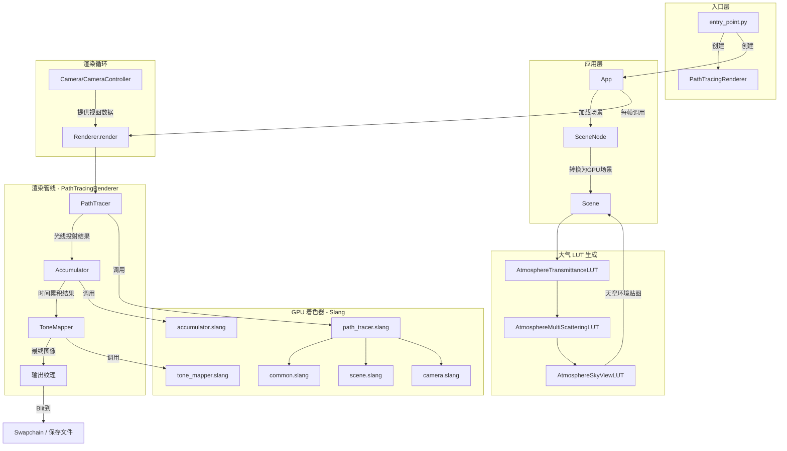
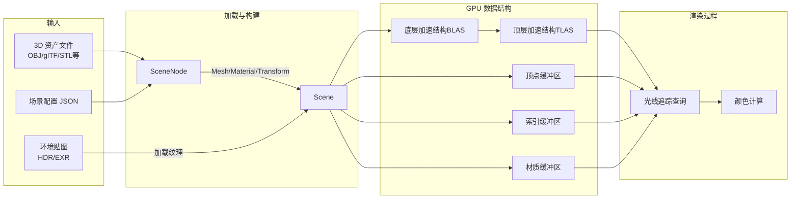
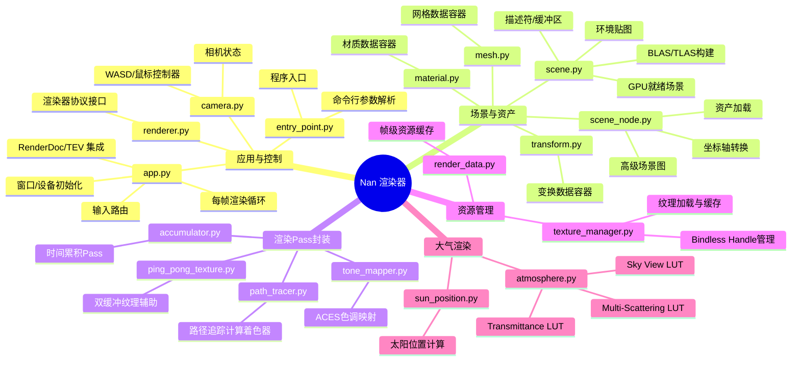

# Nan - GPU 路径追踪渲染器项目文档

## 项目概述

**Nan** 是一个使用 Python + Slang (通过 SlangPy) 构建的**教育性**实时 GPU 路径追踪渲染器。

### 核心特性
- **单向路径追踪** - 简单易懂，便于扩展
- **Lambert BSDF** - 无复杂材质模型，适合学习
- **无头模式 (Headless)** - 支持无窗口渲染，便于 AI 辅助调试
- **目标硬件** - 支持 DXR/Vulkan-RT 的 GPU

---

## 渲染管线流程图



---

## 数据流向图



---

## 模块架构图



---

## 重要文件功能说明

### 核心应用层

| 文件 | 功能描述 | 关键类/函数 |
|------|----------|------------|
| [entry_point.py](file:///e:/PythonProject/Nan/entry_point.py) | **程序入口**，创建 `PathTracingRenderer` 并启动 `App` | `main()` |
| [app.py](file:///e:/PythonProject/Nan/app.py) | **应用程序核心**，窗口/设备初始化、输入路由、渲染循环、RenderDoc/TEV 集成 | `App`, `AppConfig` |
| [renderer.py](file:///e:/PythonProject/Nan/renderer.py) | **渲染器协议**接口定义，所有渲染器必须实现 | `Renderer(Protocol)` |
| [path_tracing_renderer.py](file:///e:/PythonProject/Nan/path_tracing_renderer.py) | **路径追踪渲染器**实现，编排 PathTracer→Accumulator→ToneMapper 管线 | `PathTracingRenderer` |

### 场景与资产

| 文件 | 功能描述 | 关键类/函数 |
|------|----------|------------|
| [scene_node.py](file:///e:/PythonProject/Nan/scene_node.py) | **高级场景图**，资产加载 (支持 OBJ/STL/PLY/glTF 等)，坐标轴转换，材质提取 | `SceneNode`, `load_asset()`, `demo()` |
| [scene.py](file:///e:/PythonProject/Nan/scene.py) | **GPU 就绪场景**，构建顶点/索引/材质缓冲区，BLAS/TLAS 加速结构，环境贴图 | `Scene`, `build_blas()`, `build_tlas()` |
| [mesh.py](file:///e:/PythonProject/Nan/mesh.py) | 网格数据容器 (顶点、法线、UV、索引) | `Mesh` |
| [material.py](file:///e:/PythonProject/Nan/material.py) | 材质数据容器 (颜色、粗糙度、金属度、纹理路径) | `Material` |
| [transform.py](file:///e:/PythonProject/Nan/transform.py) | 变换数据容器 (位置、旋转、缩放) | `Transform` |

### 渲染 Pass

| 文件 | 功能描述 | 关键类/函数 |
|------|----------|------------|
| [path_tracer.py](file:///e:/PythonProject/Nan/path_tracer.py) | **路径追踪 Pass** 封装，绑定 Scene 并调度计算着色器 | `PathTracer.execute()` |
| [accumulator.py](file:///e:/PythonProject/Nan/accumulator.py) | **时间累积 Pass**，float 累积带重置标志，历史纹理通过 `RenderData` 获取 | `Accumulator.execute()` |
| [tone_mapper.py](file:///e:/PythonProject/Nan/tone_mapper.py) | **ACES 色调映射 Pass**，将 HDR 转换为 LDR | `ToneMapper.execute()` |
| [ping_pong_texture.py](file:///e:/PythonProject/Nan/ping_pong_texture.py) | 双缓冲纹理辅助类 | `PingPongTexture` |

### 资源管理

| 文件 | 功能描述 | 关键类/函数 |
|------|----------|------------|
| [render_data.py](file:///e:/PythonProject/Nan/render_data.py) | **帧级资源缓存**，按名称请求纹理/缓冲区，自动创建/复用 | `RenderData.get_texture()`, `get_buffer()` |
| [texture_manager.py](file:///e:/PythonProject/Nan/texture_manager.py) | **纹理管理器**，路径缓存加载、MIP 生成、Bindless Handle 管理 | `TextureManager.load_texture()` |

### 相机与控制

| 文件 | 功能描述 | 关键类/函数 |
|------|----------|------------|
| [camera.py](file:///e:/PythonProject/Nan/camera.py) | **相机状态**与抖动、视图/投影矩阵计算；**WASD/鼠标控制器** | `Camera`, `CameraController` |

### 大气渲染

| 文件 | 功能描述 | 关键类/函数 |
|------|----------|------------|
| [atmosphere.py](file:///e:/PythonProject/Nan/atmosphere.py) | **大气 LUT 生成**：Transmittance、Multi-Scattering、Sky View | `AtmosphereTransmittanceLUT`, `AtmosphereMultiScatteringLUT`, `AtmosphereSkyViewLUT` |
| [sun_position.py](file:///e:/PythonProject/Nan/sun_position.py) | **太阳位置计算**，基于经纬度和时间 | `SunPosition`, `SunPositionData` |

### 工具与调试

| 文件 | 功能描述 | 关键类/函数 |
|------|----------|------------|
| [utils.py](file:///e:/PythonProject/Nan/utils.py) | HDR/EXR 辅助函数 | - |
| [test_print.py](file:///e:/PythonProject/Nan/test_print.py) | GPU `print` 调试演示 | - |

---

## Shader 模块 (Slang)

| 文件 | 功能描述 | 被调用者 |
|------|----------|----------|
| [common.slang](file:///e:/PythonProject/Nan/common.slang) | RNG、光线结构、采样辅助、数学工具 | 所有着色器 |
| [scene.slang](file:///e:/PythonProject/Nan/scene.slang) | GPU 端场景访问器 (顶点获取、环境采样、光线查询) | `path_tracer` |
| [camera.slang](file:///e:/PythonProject/Nan/camera.slang) | 相机矩阵、抖动、光线生成 | 所有渲染 Pass |
| [path_tracer.slang](file:///e:/PythonProject/Nan/path_tracer.slang) | **GI 路径追踪器**，余弦 BSDF，最多 5 次弹射 | `PathTracer` |
| [accumulator.slang](file:///e:/PythonProject/Nan/accumulator.slang) | 时间累积内核 | `Accumulator` |
| [tone_mapper.slang](file:///e:/PythonProject/Nan/tone_mapper.slang) | ACES 风格色调映射 | `ToneMapper` |
| [atmosphere.slang](file:///e:/PythonProject/Nan/atmosphere.slang) | LUT 生成工具 (天空/大气研究) | 大气 LUT 脚本 |

---

## 快速启动

```bash
# 安装依赖
pip install -r requirements.txt

# 运行默认 Cornell Box 场景
python entry_point.py

# 无头模式渲染
python entry_point.py --headless --frames 128 --output result.png

# 自定义分辨率
python entry_point.py --headless --width 3840 --height 2160 --frames 256
```

## 热键

| 按键 | 功能 |
|------|------|
| `WASD` + 鼠标 | 相机控制 |
| `F1` | TEV 查看器 |
| `F2` | 截图 |
| `F11` | RenderDoc 捕获 |
| `Esc` | 退出 |

---

## 项目目录结构

```
Nan/
├── Doc/                          # 文档目录
│   └── ProjectOverview.md        # 本文档
├── entry_point.py                # 程序入口
├── app.py                        # 应用程序核心
├── renderer.py                   # 渲染器协议
├── path_tracing_renderer.py      # 路径追踪渲染器
├── path_tracer.py                # 路径追踪 Pass
├── accumulator.py                # 累积 Pass
├── tone_mapper.py                # 色调映射 Pass
├── scene.py                      # GPU 场景
├── scene_node.py                 # 场景图/资产加载
├── camera.py                     # 相机与控制器
├── render_data.py                # 资源缓存
├── texture_manager.py            # 纹理管理
├── atmosphere.py                 # 大气 LUT
├── sun_position.py               # 太阳位置
├── mesh.py                       # 网格数据
├── material.py                   # 材质数据
├── transform.py                  # 变换数据
├── utils.py                      # 工具函数
├── ping_pong_texture.py          # 双缓冲纹理
├── low_discrepancy_disk_pattern.py # 空间采样模式
├── *.slang                       # GPU 着色器
├── CLAUDE.md                     # AI Agent 指南
├── readme.md                     # 项目 README
└── requirements.txt              # Python 依赖
```
